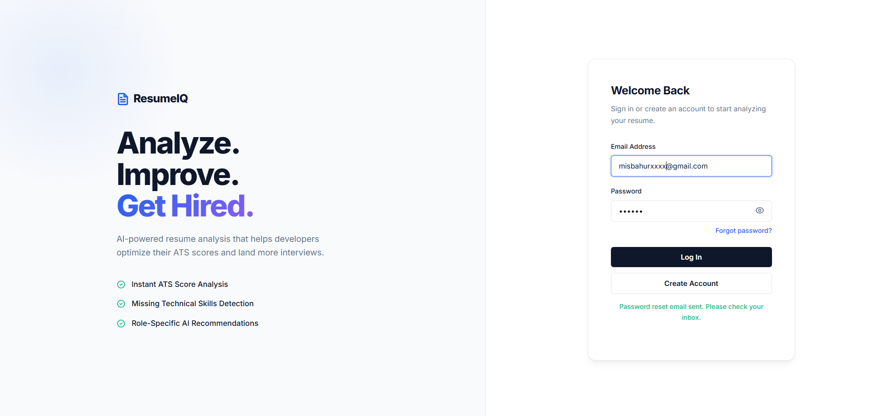

# ResumeIQ | AI-Powered Resume Analyzer



**ResumeIQ** is a full-stack AI-powered resume analyzer designed to help developers, students, freshers, and job seekers improve their resumes for modern Applicant Tracking Systems (ATS).

Users can upload a PDF resume or paste resume text, select a target engineering role, and receive an AI-powered ATS score, detected technical strengths, missing skills, and personalized recommendations.

## Features

- **PDF Resume Upload** — Upload and analyze PDF resumes directly.
- **Paste Resume Text** — Analyze resume content without uploading a file.
- **Resume Detection** — Helps identify and reject documents that do not appear to be resumes or CVs.
- **ATS Score Generation** — Generates an ATS-oriented score from 0–100.
- **Dynamic Strengths** — Extracts technical skills explicitly found in the resume.
- **Missing Skills Analysis** — Identifies important role-specific technologies and keywords that are absent.
- **AI Recommendations** — Generates targeted suggestions to improve resume content and impact.
- **Role-Based Analysis** — Evaluates resumes according to the selected engineering role.
- **Secure Authentication** — Supports account creation, login, logout, and password reset using Firebase Authentication.
- **Secure PDF Processing** — Restricts uploads to PDF files with a maximum size of 5 MB.
- **Temporary File Cleanup** — Uploaded files are removed from the server after PDF text extraction.
- **Responsive Interface** — Designed for both desktop and mobile devices.

## Supported Roles

ResumeIQ currently supports:

- Frontend Developer
- Backend Developer
- Full Stack Developer

## Tech Stack

### Frontend

- HTML5
- CSS3
- Vanilla JavaScript
- Firebase Authentication
- Responsive UI
- Vercel

### Backend

- Node.js
- Express.js
- Multer
- `pdf-parse`
- Render

### AI

- Google Gemini API
- `@google/generative-ai`
- Model configured as `gemini-3.5-flash`
- Structured JSON responses
- Role-specific prompt engineering

## How ResumeIQ Works

1. Create an account or log in.
2. Upload a PDF resume or paste resume text.
3. Select a target engineering role.
4. ResumeIQ extracts the resume content.
5. The backend sends the resume content and selected role to the Gemini API.
6. Gemini evaluates the resume using structured instructions.
7. ResumeIQ displays:
   - ATS score
   - Technical strengths
   - Missing skills
   - Target role
   - Overall assessment
   - Strategic recommendations

## Security & File Handling

ResumeIQ includes several safeguards for handling user input:

- PDF-only file uploads
- Maximum upload size of 5 MB
- Gemini API credentials stored in backend environment variables
- Temporary uploaded files removed after text extraction
- Resume/CV validation before displaying analysis results
- CORS configuration for the deployed frontend

Sensitive API credentials should never be committed to the repository.

## Getting Started

### Prerequisites

Make sure you have:

- Node.js installed
- npm installed
- A Google Gemini API key
- Firebase project credentials

### 1. Clone the Repository

```bash
git clone https://github.com/misbahur860-ship-it/resumeiq-ai.git
cd resumeiq-ai
```

### 2. Install Dependencies

```bash
npm install
```

### 3. Configure Environment Variables

Create a `.env` file and add your Gemini API key:

```env
GEMINI_API_KEY=your_gemini_api_key
```

Do not commit the `.env` file to GitHub.

### 4. Start the Backend

```bash
node backend/server.js
```

The backend runs on port `5000` by default unless a different `PORT` environment variable is configured.

## Deployment

### Frontend

Deployed with Vercel.

### Backend

Deployed with Render.

### Live Application

https://resumeiq-ai-gamma.vercel.app

## Project Structure

```text
resumeiq-ai/
│
├── backend/
│   └── server.js
│
├── index.html
├── package.json
├── .gitignore
├── LICENSE
├── README.md
└── resumeiq-dashboard.png
```

## Current Status

ResumeIQ is an actively developed MVP with the core resume-analysis workflow completed.

Current functionality includes:

- Authentication
- Password reset
- PDF upload
- Resume text input
- Resume validation
- Role selection
- Gemini-powered analysis
- ATS scoring
- Dynamic strengths
- Missing skills
- Personalized recommendations
- Responsive desktop and mobile UI

## Planned Improvements

Future improvements may include:

- Additional target roles
- Improved ATS scoring and analysis
- More detailed role matching
- Enhanced results visualization
- Resume analysis history
- User dashboard improvements
- Additional AI-powered resume optimization tools

## License

This project is licensed under the MIT License.

---

Built as a full-stack AI SaaS portfolio project.
